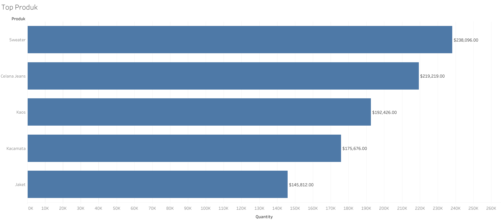
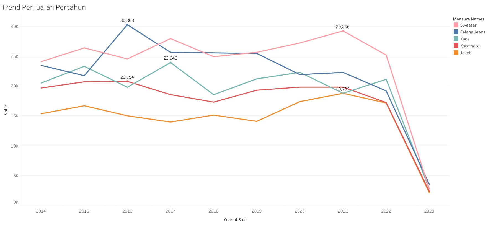
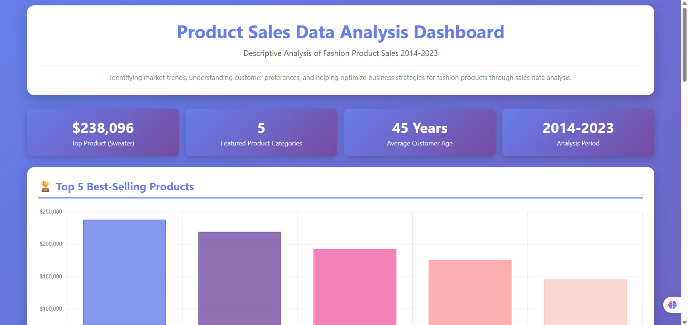

# 👕 Product Sales Analysis Dashboard – Diki Darmawan

## 📘 Overview
This project presents an **interactive dashboard** that visualizes the key factors influencing product sales performance in the fashion industry.  
The dashboard provides insights into **sales trends, production patterns, and customer demographics** affecting revenue from **2014 to 2023**.

---

## 🎯 Project Scope
- Analyze and visualize sales trends across different product categories over a 10-year period.  
- Display correlations between production volume and sales revenue.  
- Explore how customer demographics (age and location) impact product preferences.  
- Identify top-performing products and declining trends.  
- Provide actionable recommendations to improve sales and inventory management.

---

## ⚙️ Key Features
- Interactive and visual representation of multi-dimensional sales data.  
- Clear explanations and contextual insights for each visualization.  
- **Responsive dashboard** accessible on both desktop and mobile devices.  
- Organized tabbed interface for **Conclusions**, **Recommendations**, and **Methodology**.  
- Real-time hover interactions for detailed data exploration.

---

## 🧰 Technology Stack
| Tool / Language | Purpose |
|------------------|----------|
| **Python (pandas, numpy, matplotlib, seaborn)** | Data cleaning, transformation, and exploratory analysis |
| **Microsoft Excel** | Data validation and summary analysis using Pivot Tables |
| **Tableau Public** | Advanced data visualization and trend analysis |
| **Chart.js** | Interactive charting library for frontend visualization |
| **HTML/CSS/JavaScript** | Responsive dashboard interface development |
| **GitHub Pages** | Hosting for live dashboard deployment |

---

## 📊 Data Analysis Methodology
The initial dataset was sourced from internal company systems and processed using **Python** and **Microsoft Excel**.  
The workflow follows a complete **data preparation and visualization pipeline**:

1. **Data Cleaning with Python**  
   - Removed duplicates and null values using `pandas`.  
   - Standardized numerical and date formats.  
   - Handled missing values using mean/median imputation.  
   - Normalized and encoded categorical variables.  

2. **Exploratory Data Analysis (EDA)**  
   - Conducted descriptive statistics with **pandas** and **numpy**.  
   - Created correlation heatmaps and pair plots using **seaborn**.  
   - Identified relationships between product categories, revenue, and production.  

3. **Data Summarization in Excel**  
   - Built **Pivot Tables** to summarize sales by product, year, and customer segment.  
   - Analyzed trends in production quantity and revenue across categories.  
   - Calculated average customer age by region.

4. **Descriptive Analysis**  
   - Combined Python and Excel findings to understand relationships between production, revenue, and demographics.  

5. **Visualization & Dashboard Development**  
   - Visualized key results using **Tableau Public** for trend exploration.  
   - Integrated visuals into a **Chart.js-powered dashboard** for real-time interactivity.

---

## 📈 Example Visualizations

### 🏆 Top 5 Best-Selling Products
Displays total revenue for the top-performing products.  
Sweater leads with $238,096, followed by Jeans ($219,219) and T-Shirt ($192,426).

  

---

### 💵 Annual Sales Trends
Shows revenue trends across the 10-year period.  
Demonstrates a strong correlation between production volume and sales revenue.  
Identifies critical inflection points in sales performance.

  

---

## 💡 Key Insights

### 🛍️ Sales Performance
- Sweater is the top-performing product with total revenue of **$238,096 (2014–2023)**.  
- The top 5 products dominate total sales: Sweater, Jeans, T-Shirt, Sunglasses, and Jacket.  
- Significant revenue gaps indicate strong customer preference concentration.

### 📉 Critical Trends
- **Peak Year:** 2021 recorded the highest production and sales volume.  
- **Decline:** From 2021–2023, both metrics dropped by 65–90%.  
- **Correlation:** Sales revenue is directly impacted by production output.

### 👥 Customer Demographics
- Target age group: **42–47 years**.  
- Major markets: Jakarta (44y), Yogyakarta (45y), Semarang (46y), Bandung (47y).  
- Consistent age distribution indicates a well-defined customer segment.

### 🧾 Product Portfolio
- Price range: $12 (Hat) – $92 (Sweater).  
- Stock range: 53 (Scarf) – 182 units (Jacket/Hat).  
- Inventory imbalance highlights restocking opportunities for high-demand items.

---

## 🧩 Recommendations

### 1️⃣ Immediate Actions
- Investigate the **2021–2023 sales decline** to identify root causes.  
- **Optimize inventory** based on product demand and turnover.  
- Focus marketing efforts on **Sweater**, **Jeans**, and **T-Shirt** categories.

### 2️⃣ Strategic Initiatives
- Develop new product lines tailored to the **40s age demographic**.  
- Launch location-specific marketing campaigns in **Jakarta, Bandung, Yogyakarta, Semarang, and Bali**.  
- Reassess pricing strategies for low-performing products.  
- Implement customer loyalty programs to retain high-value buyers.

### 3️⃣ Operational Improvements
- Conduct **quarterly sales trend monitoring**.  
- Align **production volume** with demand forecasts.  
- Improve supply chain efficiency for faster market response.  
- Continue leveraging **data-driven decision-making** in operations.

### 4️⃣ Future Research
- Conduct **customer satisfaction surveys** for feedback-driven insights.  
- Perform **competitive benchmarking** with similar brands.  
- Explore **new customer demographics** and market regions.  
- Innovate **new product categories** based on behavioral data.

---

## 🧭 Interactive Dashboard

The dashboard was built using **Tailwind CSS** and **Chart.js**, integrating results from Python and Excel analyses for real-time visualization.

**Dashboard Features:**
- Top 5 best-selling products (bar chart)  
- Annual production and sales trends (line charts)  
- Customer demographics by location (doughnut chart)  
- Product portfolio analysis (mixed chart)  
- Tab navigation for conclusions, recommendations, and methodology  

  

<em>Figure: Interactive dashboard visualizing product performance, customer demographics, and sales trends.</em>

  

---

## 🎓 Academic Context
- **Course:** Data Mining  
- **Program:** Informatics Engineering  
- **Institution:** University of Lampung  
- **Academic Year:** 2024/2025
