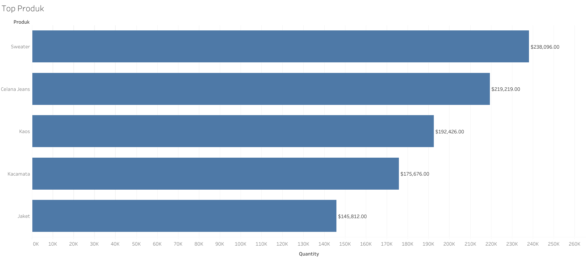
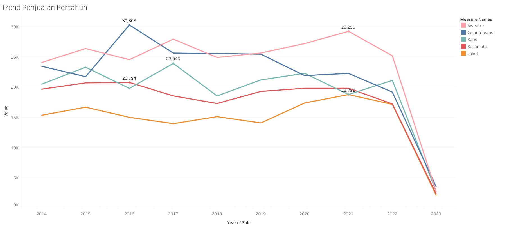

# Product Sales Analysis Dashboard - Diki Darmawan

## Overview
This project features an interactive dashboard visualizing key factors influencing product sales performance in the fashion industry. The dashboard provides insights into sales trends, production patterns, and customer demographics that affect product revenue from 2014 to 2023.

## Project Scope
- Analyze and visualize sales trends across different product categories over a 10-year period.
- Display the correlation between production volume and sales revenue.
- Show the impact of customer demographics (age and location) on product preferences.
- Identify top-performing products and declining trends.
- Provide actionable recommendations to improve sales performance and inventory management.

## Features
- Visual and interactive representation of sales data with multiple chart types.
- Clear insights and contextual explanations for each visualization.
- Responsive dashboard design accessible on desktop and mobile devices.
- Tabbed interface for organized presentation of conclusions, recommendations, and methodology.
- Real-time interactive charts with hover effects for detailed data exploration.

## Technology Stack
- Microsoft Excel: Data collection, cleaning, exploration, and analysis using pivot tables.
- Tableau Public: Advanced data visualization for trend analysis.
- Chart.js: Interactive JavaScript charting library for dashboard visualizations.
- HTML/CSS/JavaScript: Frontend development for responsive dashboard interface.
- GitHub Pages: Hosting static project content.

## Data Analysis Methodology
The initial data was collected from internal company systems and processed using Microsoft Excel. The main steps were:
- **Data Cleaning:** Removing duplicates, fixing input errors, and ensuring data consistency across three datasets (Customers, Products, Sales).
- **Data Exploration:** Examining distributions and identifying key variables such as product categories, sales periods, and customer demographics.
- **Pivot Tables:** Used to group and summarize data based on:
  - Total sales revenue by product
  - Annual sales trends by product category
  - Annual production quantities
  - Average customer age by location
- **Descriptive Analysis:** Multi-dimensional analysis to identify patterns and correlations between variables.
- **Visualization:** The analyzed data was then visualized using Tableau Public and Chart.js for the interactive dashboard.

## Dashboard Visualization Description

1. **Top 5 Best-Selling Products (Bar Chart)**
   - Displays total revenue for the top-performing products.
   - Sweater leads with $238,096, followed by Jeans ($219,219) and T-Shirt ($192,426).

2. **Annual Production Trends (Line Chart)**
   - Shows production quantity trends from 2014-2023.
   - Highlights peak production in 2021 and dramatic decline through 2023.
   - Tracks 5 major product categories simultaneously.

3. **Annual Sales Trends (Line Chart)**
   - Illustrates revenue trends over the 10-year period.
   - Demonstrates strong correlation between production volume and sales revenue.
   - Identifies critical inflection points in sales performance.

4. **Average Customer Age by Location (Doughnut Chart)**
   - Presents demographic distribution across major cities.
   - Shows average customer ages ranging from 42-47 years.
   - Covers key locations: Yogyakarta, Bali, Semarang, Bandung, and Jakarta.

5. **Product Profile: Price & Stock (Mixed Chart)**
   - Combines bar chart (price) and line chart (stock levels).
   - Provides a comprehensive view of product portfolio.
   - Enables inventory optimization analysis.

Each visualization includes contextual explanations and insights to help stakeholders interpret the data effectively.

## Example Visualization

- Image:  
    
  Sweater leads in sales, followed by Jeans and T-Shirt, showing strong customer preference.

- Image:  
    
  Shows peak performance in 2021 and dramatic decline thereafter, highlighting the need for strategic intervention.

## How to Access the Dashboard
View the live dashboard at:  
[https://dickydarmaa.github.io/product-sales-dashboard/](https://dickydarmaa.github.io/product-sales-dashboard/)  
Or download the HTML file and open it locally in your browser.

## Dashboard Usage Instructions
- **Navigate the Interface:** Scroll through different sections to view various analyses.
- **Interact with Charts:** Hover over data points to see detailed values and additional information.
- **Use Tab Navigation:** Click on "Conclusion," "Recommendations," or "Methodology" tabs to explore different aspects of the analysis.
- **Responsive Design:** Access the dashboard from desktop, tablet, or mobile devices for optimal viewing experience.
- **Export Insights:** Use the visual insights to understand key factors affecting product sales performance and make data-driven decisions.

## Key Insights from Data

### Sales Performance
- Sweater is the top-performing product with $238,096 in total revenue (2014-2023).
- Top 5 products account for the majority of sales: Sweater, Jeans, T-Shirt, Sunglasses, and Jacket.
- Significant revenue disparity between top and lower-performing products indicates clear customer preferences.

### Critical Trends
- Peak year: 2021 showed the highest production and sales across all product categories.
- Dramatic decline: 2021-2023 period shows 65-90% decrease in both production and sales.
- Strong correlation: Production volume directly impacts sales revenue across all products.

### Customer Demographics
- Target age group: Average customer age ranges from 42-47 years across major cities.
- Geographic distribution: Key markets include Jakarta (44 years), Yogyakarta (45 years), Semarang (46 years), and Bandung (47 years).
- Age consistency: Relatively uniform age distribution suggests focused target market.

### Product Portfolio
- Price range: Products priced from $12 (Hat) to $92 (Sweater).
- Stock levels: Vary significantly from 53 (Scarf) to 182 units (Jacket, Hat).
- Inventory imbalance: Some high-revenue products have lower stock, suggesting optimization opportunities.

## Recommendations

### 1. Immediate Actions
- Investigate 2021-2023 decline: Conduct deep-dive analysis to identify root causes of the dramatic sales drop.
- Optimize inventory: Adjust stock levels based on declining trends to reduce excess inventory and carrying costs.
- Focus on top performers: Allocate marketing resources to Sweater, Jeans, and T-Shirt categories.

### 2. Strategic Initiatives
- Product development: Create new product lines tailored to the 40s age demographic.
- Regional marketing: Implement location-specific campaigns in Jakarta, Bandung, Yogyakarta, Semarang, and Bali.
- Price optimization: Review pricing strategy for underperforming products.
- Customer retention: Develop loyalty programs targeting the core 42-47 age segment.

### 3. Operational Improvements
- Regular monitoring: Establish quarterly trend analysis to detect changes early.
- Production planning: Align production volumes more closely with demand forecasts.
- Supply chain efficiency: Reduce lead times to respond faster to market changes.
- Data-driven decisions: Continue leveraging analytics for strategic planning.

### 4. Future Research
- Customer satisfaction: Survey customers to understand preferences and pain points.
- Competitive analysis: Benchmark against industry competitors.
- Market expansion: Explore opportunities in underrepresented age groups and locations.
- Product innovation: Test new product categories based on customer feedback.

## Academic Context
- **Course:** Data Mining
- **Program:** Informatics Engineering
- **Institution:** University of Lampung
- **Academic Year:** 2024/2025

